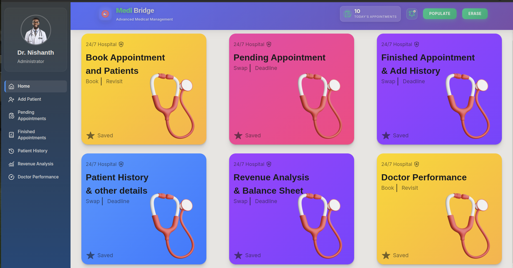
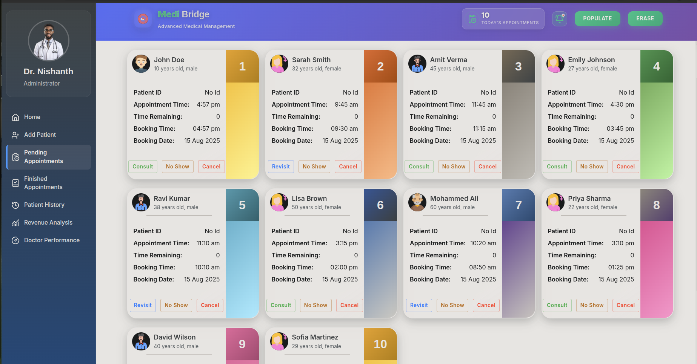
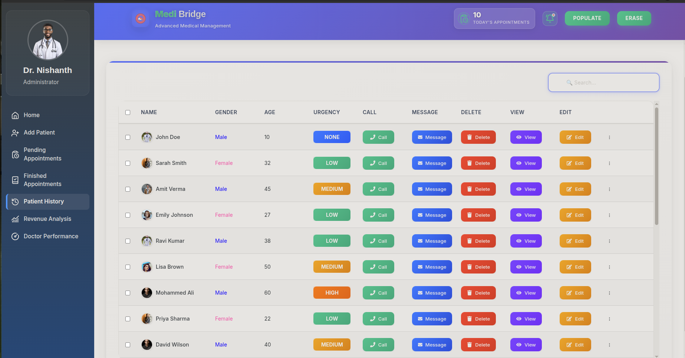
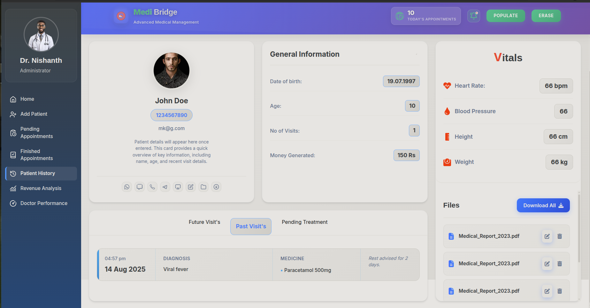
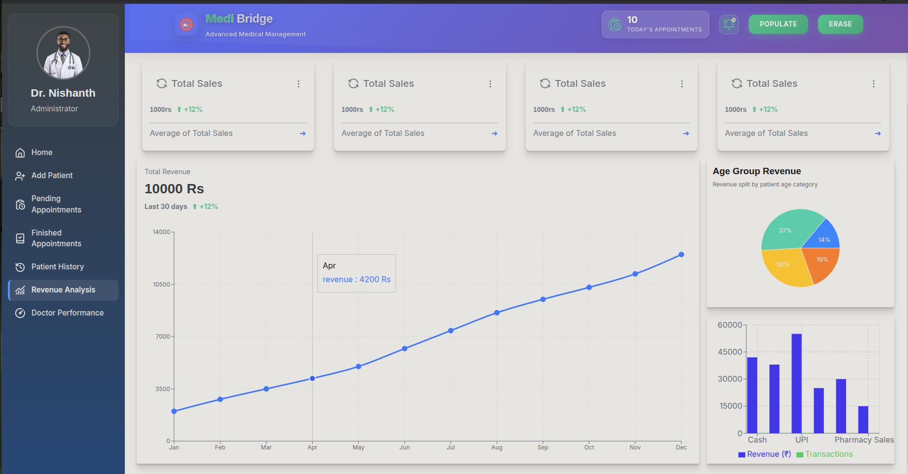

# Medi-Bridge 🏥

_A bridge for old-school doctors moving from paper to modern software._

[](https://mknishanth1997.github.io/Medi-Bridge/)


---

## 📖 About the Project

**Medi-Bridge** is a modern appointment management system built for doctors and clinics transitioning from **traditional paper records** to **digital solutions**.  
It helps doctors manage appointments, keep track of diagnoses, view revenue analytics, and analyze doctor performance — all in one clean, responsive dashboard.

---

## 📸 Screenshots

**Dashboard View**  
Big and bold navigaion


**Appointment Booking**  


**View Patient History**  



**Revenue Analysis**  


---

## ✨ Features

- 📅 Book, cancel, and reschedule appointments
- 📝 Add and manage patient diagnoses
- 📊 Revenue analytics & doctor performance charts
- 🔔 View and manage pending appointments
- 🖥 Simple UI for doctors not used to modern software
- 📱 Fully responsive design

---

## 🛠 Tech Stack

- **Frontend Framework:** [React](https://reactjs.org/) + [Vite](https://vitejs.dev/) + [TypeScript](https://www.typescriptlang.org/)
- **Styling:** CSS3 (Flexbox, Grid, Animations, Custom Variables)
- **Charts & Data Viz:** [Recharts](https://recharts.org/)
- **Tables & Data Handling:** [React Table](https://tanstack.com/table/v8)
- **UI Components:** [Radix UI](https://www.radix-ui.com/) for accessible, headless UI primitives
- **Icons & Assets:** [React Icons](https://react-icons.github.io/react-icons/), SVGs via [SVGR](https://react-svgr.com/)
- **State Management:** React Hooks (useState, useEffect, Context API)
- **Routing:** React Router
- **Build Tools:** Vite + PostCSS
- **Deployment:** GitHub Pages

---

## 🚀 Live Demo

🔗 **[View Medi-Bridge Live](https://mknishanth1997.github.io/Medi-Bridge/)**

---

## ⚙️ Installation

1️⃣ **Clone the repo**

```bash
git clone https://github.com/mknishanth1997/Medi-Bridge.git
```

2️⃣ **Install dependencies**

```
npm install
```

3️⃣ **Run locally**

```
npm run dev
```

4️⃣ **Build for production**

```
npm run build
```

## Extra Details:

## 📂 Project Structure

This project follows a hybrid folder structure, combining feature-based organization with component sub-division.

- Top-level division is by feature — each major application feature (Appointments, Revenue Analysis, Patient History, etc.) has its own dedicated folder.

- Inside each feature folder, components are organized logically — each UI piece (form, card, chart, table, etc.) lives in its own subfolder with its CSS and TypeScript side-by-side. This makes navigation intuitive and keeps related files together.

- Shared resources like assets, styles, type definitions, and utility components live in their own top-level folders for easy reuse.

```
src/
├── App.css
├── App.tsx
├── index.css
├── main.tsx
├── svg.d.ts
├── vite-env.d.ts
│
├── Alert-Dialog-Radix/
│ ├── AlertDialogRadix.css
│ └── AlertDialogRadix.tsx
│
├── assets/
│ └── icons/
│ ├── SVGCODE.tsx
│ └── Logo/
│ ├── 3dseth.avif
│ ├── babyboy.png
│ ├── babygirl.png
│ ├── bgpattern.svg
│ ├── bgpattern1.svg
│ ├── bgpattern2.svg
│ ├── bgpattern3.svg
│ ├── bgpattern4.svg
│ ├── DoctorReal.webp
│ ├── hospitalLogo.png
│ └── ...
│
├── Medi-Bridge-App/
│ ├── context/
│ │ └── DataContext.tsx
│ ├── DATA/
│ │ └── DATA.ts
│ ├── Main-Full-Screen/
│ │ ├── Main-Full-Screen.css
│ │ ├── Main-Full-Screen.tsx
│ │ ├── Side-Bar/
│ │ │ ├── Side-Bar.css
│ │ │ └── Side-Bar.tsx
│ │ └── User-View-Screen/
│ │ ├── Content-screen/
│ │ │ ├── Add-New-Patient/
│ │ │ │ ├── AddPatient.css
│ │ │ │ └── AddPatient.tsx
│ │ │ ├── Finished-Appointments/
│ │ │ │ ├── FinishedAppointment.css
│ │ │ │ ├── FinishedAppointment.tsx
│ │ │ │ └── Finished-person-card/
│ │ │ │ ├── Finished-person-card.css
│ │ │ │ └── Finished-person-card.tsx
│ │ │ ├── Home-app/
│ │ │ │ ├── Home-app.css
│ │ │ │ ├── Home-app.tsx
│ │ │ │ └── HomeScreenCard/
│ │ │ │ ├── HomeScreenCard.css
│ │ │ │ └── HomeScreenCard.tsx
│ │ │ ├── Patient-History/
│ │ │ │ ├── PatientHistory.css
│ │ │ │ ├── PatientHistory.tsx
│ │ │ │ └── Patient-Display-Screen/
│ │ │ │ ├── PatientDisplayScreen.css
│ │ │ │ └── PatientDisplayScreen.tsx
│ │ │ ├── Pending-Appointments/
│ │ │ │ ├── pendingAppointment.css
│ │ │ │ ├── pendingAppointment.tsx
│ │ │ │ ├── Pending-Appointment-card/
│ │ │ │ │ ├── pendingAppCard.css
│ │ │ │ │ └── pendingAppCard.tsx
│ │ │ │ └── Pending-Form/
│ │ │ │ ├── pending-form.css
│ │ │ │ └── Penidng-Form.tsx
│ │ │ ├── Revenue-Analysis/
│ │ │ │ ├── RevenueAnalysis.css
│ │ │ │ ├── RevenueAnalysis.tsx
│ │ │ │ ├── Pie2/
│ │ │ │ │ └── pie2.tsx
│ │ │ │ └── Revenue-components/
│ │ │ │ ├── ChartLineComp/
│ │ │ │ │ └── ChartLined.tsx
│ │ │ │ ├── Pie1/
│ │ │ │ │ └── RenderCustomizedTable.tsx
│ │ │ │ ├── Revenue-page-header/
│ │ │ │ │ ├── RevenuePageHeader.css
│ │ │ │ │ └── RevenuePageHeader.tsx
│ │ │ │ └── salesCard/
│ │ │ │ ├── salesCard.css
│ │ │ │ ├── salesCard.tsx
│ │ │ │ └── totalSalesCard/
│ │ │ └── Doctor-Performance/
│ │ │ ├── DoctorPerformance.css
│ │ │ └── DoctorPerformance.tsx
│ │ └── Header/
│ │ ├── Header.css
│ │ └── Header.tsx
│ ├── Styles/
│ │ └── Variables.css
│ └── types/
│ └── DATATYPES.ts
│
├── Testing/
│ ├── Test-Component-2/
│ └── TestComponent-1/
│ ├── TestComp1.css
│ └── TestComp1.tsx
│
└── ToolTipWrapper/
├── ToolTipWrapper.css
└── ToolTipWrapper.tsx
```

This approach ensures:

1. Scalability – easy to add new features without mixing unrelated files.

2. Maintainability – styles, logic, and assets for a component are side-by-side.

3. Natural navigation – you can drill down from a feature → specific component → code or CSS in seconds.
